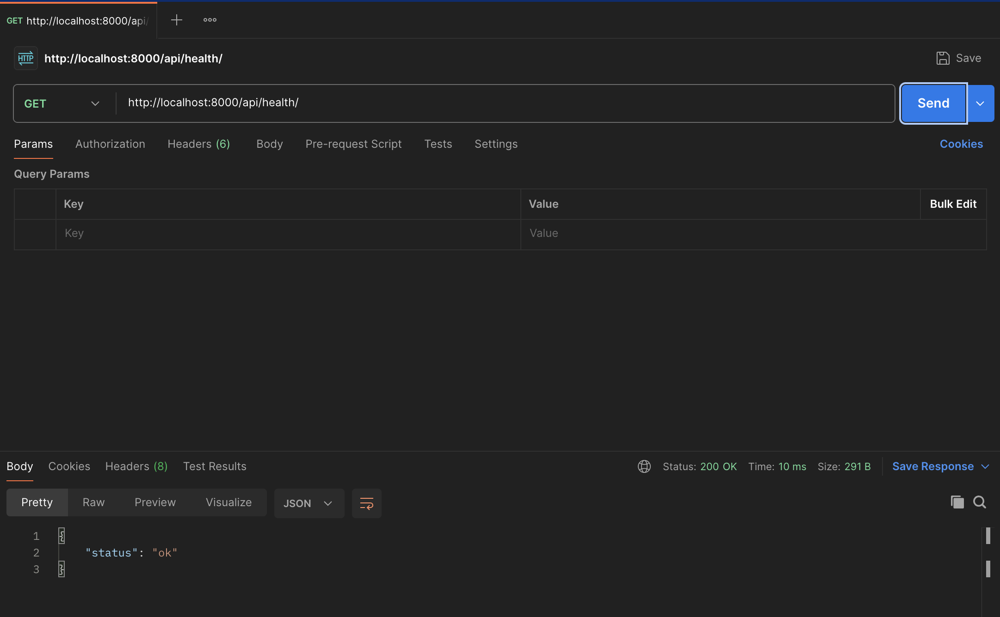
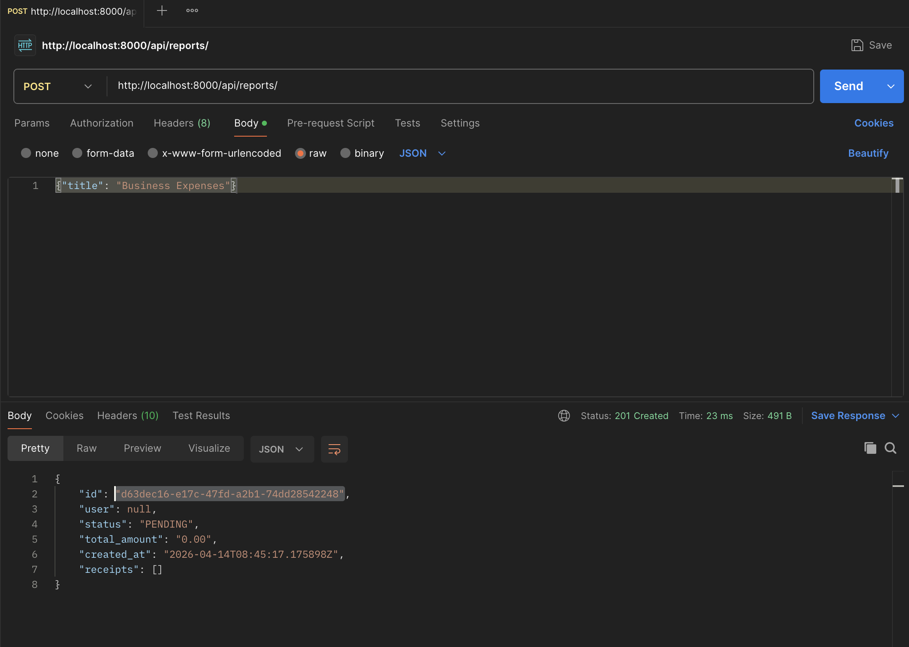
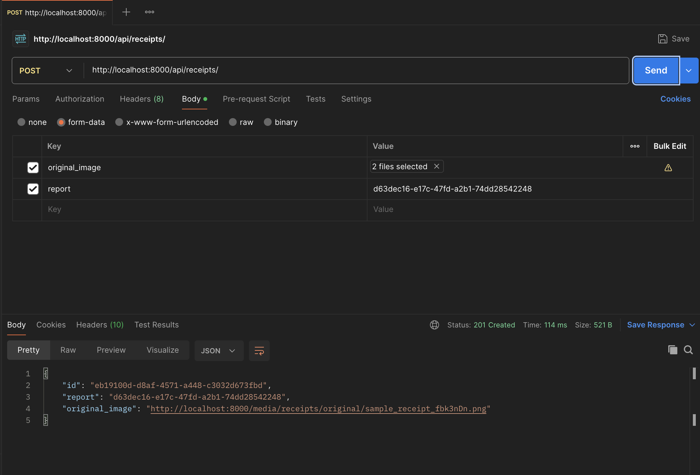
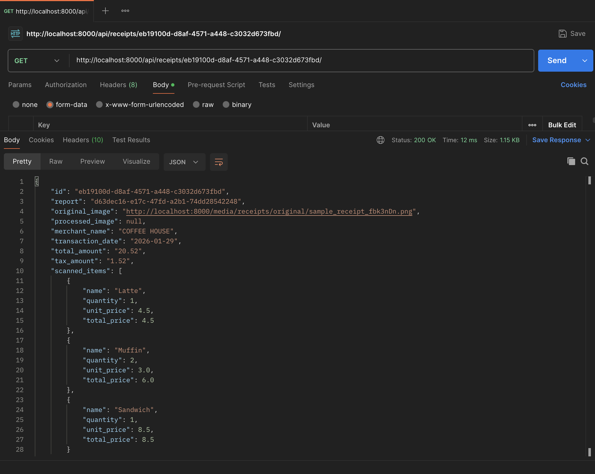
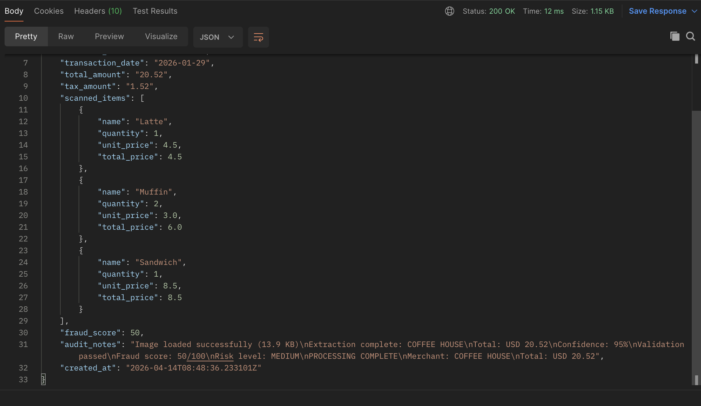

# ReceiptAgent

**AI-Powered Receipt Processing & Expense Management**

[](https://python.org)
[](https://djangoproject.com)
[](https://langchain-ai.github.io/langgraph/)
[](https://docker.com)

---

## What it does

I built this because manually logging receipts after business trips is genuinely painful. You upload a photo of any receipt, the AI reads it, pulls out the merchant name, total amount, date and every line item, scores it for fraud risk, and stores it all in a structured expense report. No typing required.

---

## Live Demo

### 1. API is live and healthy


### 2. Create an expense report


### 3. Upload a receipt image


### 4. AI extracts everything from the image



The AI read the receipt image and returned:
- **Merchant:** COFFEE HOUSE
- **Date:** 2026-01-29
- **Total:** $20.52 (Tax: $1.52)
- **Items:** Latte $4.50, Muffin x2 $6.00, Sandwich $8.50
- **Fraud Score:** 50/100 — Medium risk
- **Confidence:** 95%

All saved to PostgreSQL automatically.

---

## How it works

Upload a receipt → the system runs it through an AI pipeline:

1. **Load Image** — reads and encodes the receipt photo
2. **Extract Data** — Llama 4 vision model reads the image and returns structured JSON with merchant, items, totals
3. **Validate** — checks amounts add up, date is valid, required fields exist
4. **Fraud Check** — Llama 3 scores the receipt for suspicious patterns
5. **Save** — everything stored in PostgreSQL, report total updated

All processing runs in the background via Celery so the API responds instantly.

---

## Run it locally

You need Docker. That's it.

```bash
git clone https://github.com/khansalman12/receipt-agent.git
cd receipt-agent

# Add your free Groq API key (get one at console.groq.com)
cp .env.example .env

# Start everything — migrations run automatically
docker-compose up
```

Hit `http://localhost:8000/api/health/` — if you get `{"status": "ok"}` you're good.

---

## API Endpoints

### Expense Reports

| Method | Endpoint | What it does |
|--------|----------|--------------|
| GET | `/api/reports/` | List all reports |
| POST | `/api/reports/` | Create a new report |
| GET | `/api/reports/{id}/` | Get one report with all receipts |
| POST | `/api/reports/{id}/approve/` | Approve it |
| POST | `/api/reports/{id}/reject/` | Reject it |
| POST | `/api/reports/{id}/flag/` | Flag for manual review |

### Receipts

| Method | Endpoint | What it does |
|--------|----------|--------------|
| GET | `/api/receipts/` | List all receipts |
| POST | `/api/receipts/` | Upload a receipt image |
| GET | `/api/receipts/{id}/` | Get receipt + AI extracted data |
| DELETE | `/api/receipts/{id}/` | Delete it |

---

## Tech Stack

| Layer | What I used |
|-------|-------------|
| API | Django 5, Django REST Framework |
| AI Pipeline | LangGraph, LangChain |
| LLM | Groq — Llama 4 (vision) + Llama 3 (fraud) |
| Background Jobs | Celery + Redis |
| Database | PostgreSQL |
| Container | Docker, Docker Compose |
| Static Files | WhiteNoise |

---

## Project Structure

```
receipt-agent/
├── api/
│   ├── models.py          — ExpenseReport and Receipt models
│   ├── views.py           — REST endpoints
│   ├── serializers.py     — request/response shapes
│   ├── tasks.py           — Celery async tasks
│   └── ai/
│       ├── graph.py       — LangGraph workflow
│       ├── nodes.py       — OCR, extract, validate, fraud nodes
│       └── state.py       — shared pipeline state
├── config/                — Django settings, Celery config
├── docker-compose.yml     — local dev stack
├── Dockerfile             — production container
└── requirements.txt
```

---

## Environment Variables

| Variable | Description |
|----------|-------------|
| `GROQ_API_KEY` | Free at [console.groq.com](https://console.groq.com) |
| `SECRET_KEY` | Any random string in production |
| `DATABASE_URL` | PostgreSQL connection string |
| `REDIS_URL` | Redis connection string |
| `DEBUG` | Set to `0` in production |

---

## License

MIT — do whatever you want with it.
